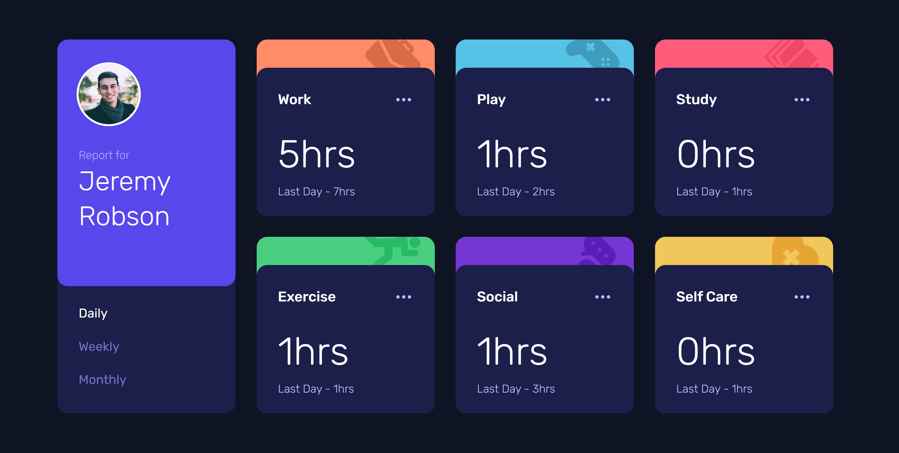
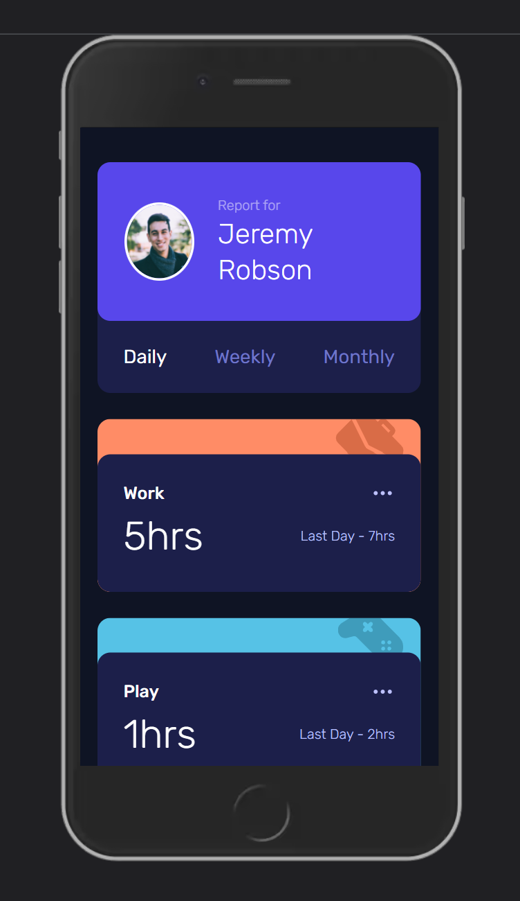

# Time-tracking-dashboard

<h1 align='center'>Time-tracking-dashboard</h1>

  <h3>
    <a href="https://time-tracking-dashboard-nm.netlify.app" target="_blank" color="white">
      Live Link
    </a>
  </h3>

   A dashboard that tracks the amount of time spent on various activities. Users can toggle between daily, weekly, and monthly time accruals.

 
 

</img>

 
 

## 💡 Technologies:

  

 

- CSS Modules
- Responsive Design
- <a href="https://www.framer.com/motion/" color="white">
      Framer Motion
    </a>

## 📄 Description

This is a challenge from front end mentor. You can learn a bit more about this challenge here: https://www.frontendmentor.io/challenges/time-tracking-dashboard-UIQ7167Jw.

I used React, CSS modules, and Framer Motion to complete this small project. It is also mobile responsive.
 

## 📷 Screenshots

### Mobile

 
 

## Questions and Feedback:

Feel free to contact me at mully7773@gmail.com if you have any questions or feedback.  
You can view more of my projects at https://github.com/Mully7773.
